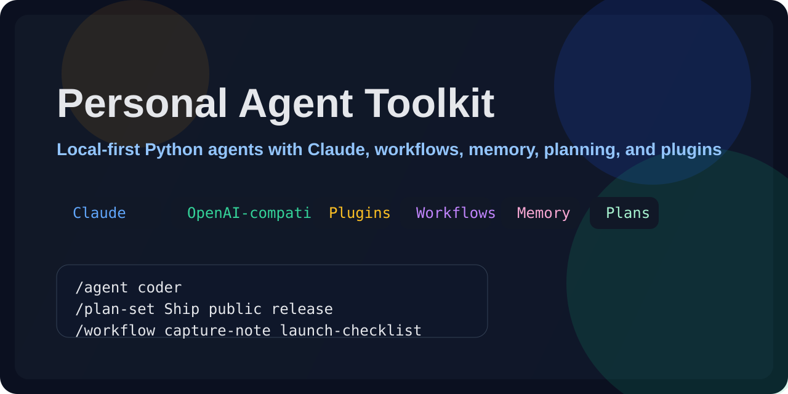
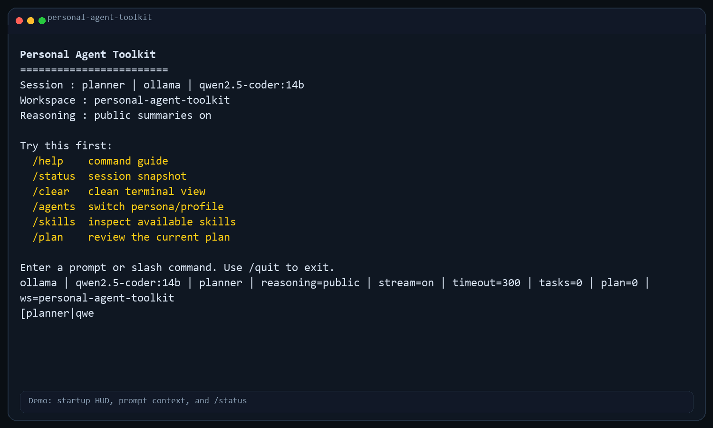
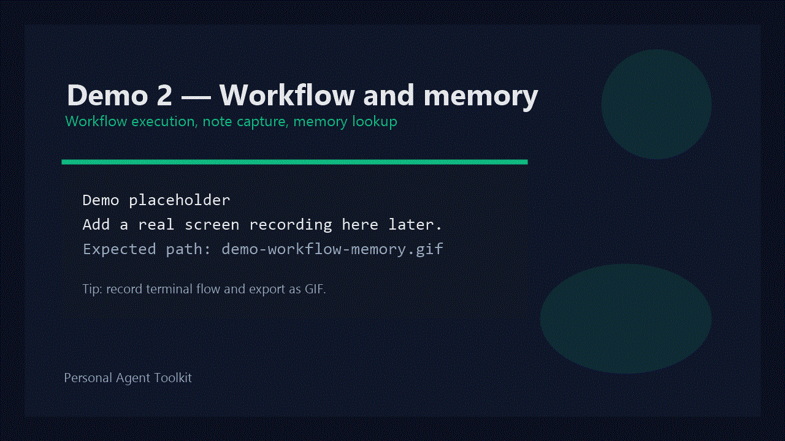
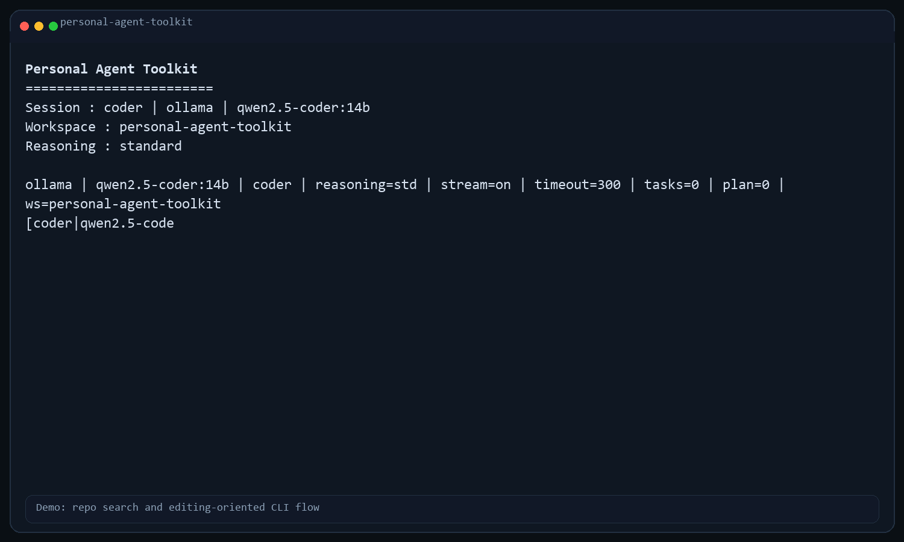

<div align="center">



# Personal Agent Toolkit

**A local-first Python CLI for personal coding agents and operator-style terminal workflows**


**Operator-style terminal UX + OpenAI-compatible local models + planning + memory + plugins**

</div>

---

## What this is

Personal Agent Toolkit is a local-first Python CLI for running coding agents from the terminal with:

- an operator-style REPL
- local and hosted model support
- built-in planning, memory, and task tracking
- slash commands for workspace automation
- plugins, workflows, and lightweight agent personas

It is designed for people who want a practical personal agent environment they can inspect, fork, and extend without adopting a heavyweight framework.

## Why this project exists

Most agent frameworks are either:

- too heavyweight for personal workflows
- too coupled to one model provider
- too hard to customize locally
- too opaque when you want to inspect what the agent is doing

This project exists to give you a simpler path:

- a **local-first** runtime
- a **Python-native** codebase
- support for **Anthropic** and **OpenAI-compatible models**
- built-in **plugins**, **skills**, **memory**, **planning**, and **subagents**
- an architecture you can actually read, fork, and extend

If you want a repo that is useful for **personal use**, **research**, or **open-source collaboration**, this is the goal.

---

## Why it matters

### 1. Local-first by default

Your workflows, notes, plans, skills, and plugins live in the repo and on your machine first.

That makes the toolkit easier to:

- understand
- debug
- customize
- trust for day-to-day use

### 2. Works with local and hosted LLMs

You can run:

- native Anthropic / Claude
- OpenAI-compatible backends
- local model gateways

That means you are not locked into one vendor or one serving stack.

### 3. Built for terminal-first extension

The project includes:

- plugin manifests
- workflow execution
- skill prompts
- MCP-style local resource registry
- planning and memory

So you can evolve it into your own terminal agent environment instead of treating it like a black box.

### 4. Open-source friendly

The repository includes:

- MIT license
- contributing guide
- code of conduct
- security policy
- CI
- issue and PR templates

So it is ready for public iteration, collaboration, and research use.

---

## Quickstart

```bash
python -m venv .venv
.venv\Scripts\activate
pip install -e .
python -m personal_agent_toolkit --prompt "/help"
```

NPM wrapper install:

```bash
npm install -g personal-agent-toolkit
personal-agent-toolkit --provider ollama --local-profile balanced
```

The npm package is a thin launcher around the Python implementation. It still requires Python 3.11+ on the machine.

Interactive mode:

```bash
python -m personal_agent_toolkit
```

Private local-model mode:

```powershell
python -m personal_agent_toolkit --provider ollama --local-profile balanced
python -m personal_agent_toolkit --provider ollama --local-profile reasoning --public-reasoning
```

Recommended interactive local setups:

- fast: `python -m personal_agent_toolkit --provider ollama --model qwen2.5-coder:3b --public-reasoning`
- balanced: `python -m personal_agent_toolkit --provider ollama --local-profile balanced --public-reasoning`
- reasoning-heavy: `python -m personal_agent_toolkit --provider ollama --local-profile reasoning --public-reasoning`

`--local-profile` now resolves against installed Ollama models when possible, so it can fall back to smaller local variants instead of assuming one exact tag is present.

---

## CLI experience

The CLI is intentionally closer to an operator console than a plain REPL:

- a compact startup HUD showing agent, provider, model, workspace, and reasoning mode
- contextual prompt like `[planner|deepseek-r1:14b+r] >`
- structured progress feed for planning, tools, streaming output, fallbacks, and waits
- public reasoning mode via `--public-reasoning`
- in-session cancellation with `Ctrl+C` for the active request
- slash commands for session state and screen control

For hosted providers or local models that support it, streamed output is rendered live in the terminal.

Distribution options:

- Python package / editable install for development
- npm global install for teams that prefer Node-based CLI distribution

---

## Demo

### Demo 1 — startup and command flow



Suggested capture:

- start the CLI
- run `/agents`
- switch with `/agent coder`
- set a plan with `/plan-set`

---

### Demo 2 — workflow + memory



Suggested capture:

- run `/workflow capture-note release-checklist`
- run `/memory`
- run `/memory-search release`

---

### Demo 3 — file automation



Suggested capture:

- `/grep TODO .`
- `/patch-preview ...`
- `/replace-block ...`
- `/diff ...`

---

## Core capabilities

- local CLI/REPL agent runtime
- native Anthropic / Claude support
- OpenAI-compatible provider support
- streaming terminal output for OpenAI-compatible backends
- file operations, shell execution, grep, glob, diff, patch previews
- persistent notes and planning
- markdown-based skills
- lightweight plugins and workflows
- local MCP-style resource registry
- delegate / spawn / wait subagent flows
- public reasoning summaries
- active-request cancellation with `Ctrl+C`

---

## Model and provider configuration

The runtime currently supports:

- `echo` for smoke testing
- `anthropic` / `claude` for native Claude access
- `openai` for the official OpenAI API
- `gemini` / `google` for Google's OpenAI-compatible Gemini endpoint
- `ollama` for a local OpenAI-compatible Ollama server
- `openai-compatible` for any other OpenAI-style endpoint or proxy

### Environment variables

```bash
PERSONAL_AGENT_TOOLKIT_PROVIDER
PERSONAL_AGENT_TOOLKIT_BASE_URL
PERSONAL_AGENT_TOOLKIT_API_KEY
PERSONAL_AGENT_TOOLKIT_MODEL
PERSONAL_AGENT_TOOLKIT_TIMEOUT
PERSONAL_AGENT_TOOLKIT_PUBLIC_REASONING
PERSONAL_AGENT_TOOLKIT_DEBUG
PERSONAL_AGENT_TOOLKIT_ANTHROPIC_VERSION
PERSONAL_AGENT_TOOLKIT_MAX_TOKENS
PERSONAL_AGENT_TOOLKIT_PYTHON
```

`PERSONAL_AGENT_TOOLKIT_PYTHON` can be used by the npm launcher to point to a specific Python interpreter.

Provider-specific API key fallbacks:

- `anthropic` / `claude` -> `ANTHROPIC_API_KEY`
- `openai` -> `OPENAI_API_KEY`
- `gemini` / `google` -> `GEMINI_API_KEY` or `GOOGLE_API_KEY`
- `ollama` -> optional `OLLAMA_API_KEY`

You can still override all of those with `PERSONAL_AGENT_TOOLKIT_API_KEY`.

### Native Claude example

```powershell
$env:PERSONAL_AGENT_TOOLKIT_PROVIDER="anthropic"
$env:PERSONAL_AGENT_TOOLKIT_API_KEY="your-anthropic-api-key"
$env:PERSONAL_AGENT_TOOLKIT_MODEL="claude-sonnet-4-5"
python -m personal_agent_toolkit
```

### Native Gemini example

```powershell
$env:PERSONAL_AGENT_TOOLKIT_PROVIDER="gemini"
$env:GEMINI_API_KEY="your-gemini-api-key"
$env:PERSONAL_AGENT_TOOLKIT_MODEL="gemini-2.5-pro"
python -m personal_agent_toolkit
```

### OpenAI-compatible example

```powershell
$env:PERSONAL_AGENT_TOOLKIT_PROVIDER="openai-compatible"
$env:PERSONAL_AGENT_TOOLKIT_BASE_URL="http://localhost:11434/v1"
$env:PERSONAL_AGENT_TOOLKIT_API_KEY="dummy"
$env:PERSONAL_AGENT_TOOLKIT_MODEL="your-model-name"
python -m personal_agent_toolkit
```

Use `openai-compatible` when you want to connect to other hosted model gateways or local proxies that expose `/chat/completions`.

### Local coding setup

For a private local setup, use the new local profile flags:

```powershell
python -m personal_agent_toolkit --provider ollama --local-profile balanced
python -m personal_agent_toolkit --provider ollama --local-profile reasoning
python -m personal_agent_toolkit --provider ollama --local-profile agentic
```

Recommended starting profiles:

- `balanced` -> `qwen2.5-coder:14b`
- `reasoning` -> `deepseek-r1:14b`
- `agentic` -> `devstral:24b`

Resolution behavior:

- the CLI prefers the intended model for the selected profile
- if you are using `ollama` and that exact model is not installed, it falls back to compatible installed models for that profile
- explicit `--model ...` always wins over local-profile auto-selection

There is also a Windows bootstrap helper that sets the right local environment variables and optionally pulls the model:

```powershell
powershell -ExecutionPolicy Bypass -File .\scripts\setup-local-agent.ps1 -Profile balanced -Pull
```

Other local OpenAI-style servers are supported through provider aliases:

```powershell
python -m personal_agent_toolkit --provider lm-studio --model qwen2.5-coder:14b
python -m personal_agent_toolkit --provider llama.cpp --model qwen2.5-coder:14b
```

See also:

- [Local model setup](docs/local-model-setup.md)

### One-off model override

```bash
python -m personal_agent_toolkit --model your-model-name
```

---

## Example command flow

```text
/status
/agents
/agent planner
/plan-set Fix the build
/plan-add Inspect current failures
/clear
/grep TODO .
/note remember to simplify the parser later
/workflow capture-note release-checklist
```

---

## Key commands

- `/help`
- `/status`
- `/clear`
- `/tools`
- `/plugins`
- `/workflows`
- `/workflow <name> [args...]`
- `/mcp-servers`
- `/mcp-resources [server]`
- `/mcp-read <uri>`
- `/note <text>`
- `/memory [limit]`
- `/memory-search <query>`
- `/skills`
- `/skill <name>`
- `/skill-show <name>`
- `/agents`
- `/agent <name>`
- `/model [name]`
- `/search <query>`
- `/plan`
- `/plan-set <title>`
- `/plan-add <step>`
- `/plan-done <step_id>`
- `/patch-preview <path> <old> <new>`
- `/replace-block <path> <old> <new>`
- `/insert-after <path> <anchor> <content>`

Useful runtime controls:

- `Ctrl+C` -> cancel the active request and stay in the REPL
- `/quit` -> exit the REPL cleanly

Suggested interactive combinations:

- interview prep: `/agent planner` with `--public-reasoning`
- coding tasks: `/agent coder`
- review/risk checks: `/agent reviewer`

---

## Repository layout

```text
personal-agent-toolkit/
├─ personal_agent_toolkit/
│  ├─ agents/
│  └─ core/
├─ plugins/
├─ mcp_servers/
├─ skills/
├─ tests/
├─ .github/
├─ README.md
├─ ARCHITECTURE.md
├─ ROADMAP.md
├─ CHANGELOG.md
└─ pyproject.toml
```

---

## Open source and collaboration

This repository is intended to support:

- personal use
- collaborative enhancement
- research experiments
- independent plugin and workflow development

The project uses the **MIT License**.

Related docs:

- [LICENSE](LICENSE)
- [CONTRIBUTING.md](CONTRIBUTING.md)
- [CODE_OF_CONDUCT.md](CODE_OF_CONDUCT.md)
- [SECURITY.md](SECURITY.md)
- [ARCHITECTURE.md](ARCHITECTURE.md)
- [ROADMAP.md](ROADMAP.md)
- [CHANGELOG.md](CHANGELOG.md)

The repository also includes:

- GitHub Actions CI
- issue templates
- pull request template

---

## Practical publishing notes

- keep secrets and personal data out of commits
- review prompts and plugin text before publishing
- keep branding neutral if you want lower trademark risk
- this repository intentionally avoids bundling mirrored upstream source trees
- verify local screenshots/GIFs do not expose keys, paths, or private repo contents

See also:

- [LEGAL_AND_PRIVACY.md](LEGAL_AND_PRIVACY.md)

---

## Verification

```bash
python -m unittest tests.test_cli tests.test_providers
python -m unittest discover -s tests -v
python -m compileall personal_agent_toolkit
```
